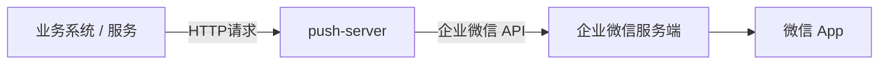

# push-server


**push-server** 是一个基于 Spring Boot 4 构建的轻量级企业微信推送服务。它封装了企业微信复杂的 API，对外提供极其简单的 HTTP 接口，支持 Docker 原生镜像部署（启动仅需 0.1s，内存占用 <50MB）。

---

## 📖 项目定位与目标

**push-server** 的核心目标是：

> **通过企业微信（WeCom），将系统消息稳定、合规地推送到用户的微信中接收。**

整体消息流转路径如下：



最终效果是：
**用户在微信中收到消息，但技术通道使用的是企业微信。**

### 为什么选择企业微信？

相比微信公众号，企业微信具备天然的系统通知优势：

* ✅ **无缝触达**：消息最终可到达 **微信 App**（需关注插件）。
* ✅ **主动推送**：支持无限制的主动消息推送，适合告警、通知。
* ✅ **稳定合规**：官方允许的系统消息通道，不涉及内容风控。
* ✅ **简单易用**：无需复杂的模板消息申请，开发接口清晰。

**push-server** 的角色非常纯粹：它不关心业务含义，只作为一个**可靠的消息投递管道**。

---

## ⚡️ 核心特性

* **轻量级**：基于 Spring Boot 4 + GraalVM Native Image，极致的启动速度和资源占用。
* **开箱即用**：无需数据库，无需复杂配置，只需填写 API Key 即可运行。
* **标准化 API**：统一的 HTTP 接口，屏蔽不同渠道的实现细节。
* **容器友好**：提供 Docker 镜像，支持环境变量配置，完美适配 K8s。
* **扩展性强**：底层依赖 `push-core`，基于 SPI 架构，易于扩展其他渠道。
* **安全拦截**：API Key 校验 + 失败次数封禁，降低暴力请求风险。

---

## 🛠 前置准备

在使用本服务前，你需要完成企业微信侧的配置：

1. **注册企业微信**：个人也可以免费注册。
2. **创建自建应用**：
* 进入 [企业微信管理后台](https://work.weixin.qq.com/wework_admin/frame) -> `应用管理` -> `创建应用`。
* 获取 **AgentId** 和 **Secret**（对应配置中的 `push.wecom.agent-id` 与 `push.wecom.app-secret`）。
* 获取 **企业ID (CorpId)**（对应配置中的 `push.wecom.app-key`）。


3. **关键步骤**：
* 进入 `我的企业` -> `微信插件`。
* 用你的个人微信扫描二维码，**关注该企业**。
* *注意：只有关注后，消息才能直接在微信 App 中通过“服务通知”弹出。*


---

## 🚀 快速开始 (Docker)

推荐使用 Docker 运行，无需安装 Java 环境。

### 方式一：使用环境变量启动 (最快)

直接将配置参数通过 `-e` 传入：

```bash
docker run -d \
  --name push-server \
  -p 8000:8000 \
  -e PUSH_AUTH_KEY="替换为自己的key" \
  -e PUSH_WECOM_APP_KEY="你的应用AppKey" \
  -e PUSH_WECOM_APP_SECRET="你的应用AppSecret" \
  -e PUSH_WECOM_AGENT_ID="1000001" \
  qingzhou/push-server:latest

```

### 方式二：挂载配置文件 (推荐)

如果你希望管理配置文件，可以挂载宿主机的 `application.yml`：

1. 创建 `application.yml` 文件：
```yaml
push:
  auth:
    key: "替换为自己的key"
  security:
    block-minutes: 30
    fail-window-minutes: 5
    max-fails: 5
  wecom:
    app-key: "你的应用AppKey"
    app-secret: "你的应用AppSecret"
    agent-id: "1000001"
    webhook-url:

```


2. 启动容器：
```bash
docker run -d \
  --name push-server \
  -p 8000:8000 \
  -v $(pwd)/application.yml:/workspace/config/application.yml \
  qingzhou/push-server:latest

```


---

## 🔌 API 文档

服务启动后，默认监听 `8000` 端口。

### 发送消息接口

* **URL**: `/v1/push`
* **Method**: `POST`
* **Content-Type**: `application/json`
* **Header**: `X-API-Key: <push.auth.key>`

#### 请求参数示例

**1. 发送普通文本 (Text)**

```bash
curl -X POST http://localhost:8000/v1/push \
  -H "X-API-Key: 替换为自己的key" \
  -H "Content-Type: application/json" \
  -d '{
    "target": "ZhangSan|LiSi",
    "type": "TEXT",
    "content": "系统通知：您的任务已构建完成。"
  }'

```

*注：`target` 为企业微信通讯录中的 `UserID`，多人用 `|` 分隔，`@all` 表示发给所有人。*

**2. 发送 Markdown (推荐)**

```bash
curl -X POST http://localhost:8000/v1/push \
  -H "X-API-Key: 替换为自己的key" \
  -H "Content-Type: application/json" \
  -d '{
    "target": "@all",
    "type": "MARKDOWN",
    "title": "生产环境告警",
    "content": "**⚠️ 生产环境告警**\n> 服务：`Order-Service`\n> 状态：<font color=\"warning\">高负载 (90%)</font>\n> [查看详情](http://monitor.com)"
  }'

```

`type` 为空时默认 `TEXT`，支持：`TEXT`、`MARKDOWN`、`TEXT_CARD`、`IMAGE`、`NEWS`。
鉴权失败次数超过阈值时会触发封禁并返回 `429`，阈值与时长可在 `push.security` 中配置。

---

## ⚙️ 配置说明

完整的 `application.yml` 配置项如下：

```yaml
server:
  port: 8000

push:
  auth:
    key: "替换为自己的key"
  security:
    # 如果不配置或配置为 null，则使用默认值
    block-minutes: 30      # 封禁时长（分钟）
    fail-window-minutes: 5 # 失败计数窗口（分钟）
    max-fails: 5           # 窗口内最大失败次数
  wecom:
    app-key: ""     # 应用 AppKey
    app-secret: ""  # 应用 AppSecret
    agent-id: ""    # 应用 AgentId
    webhook-url: "" # 可选

```

---
