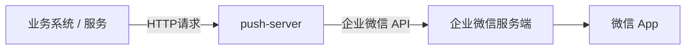
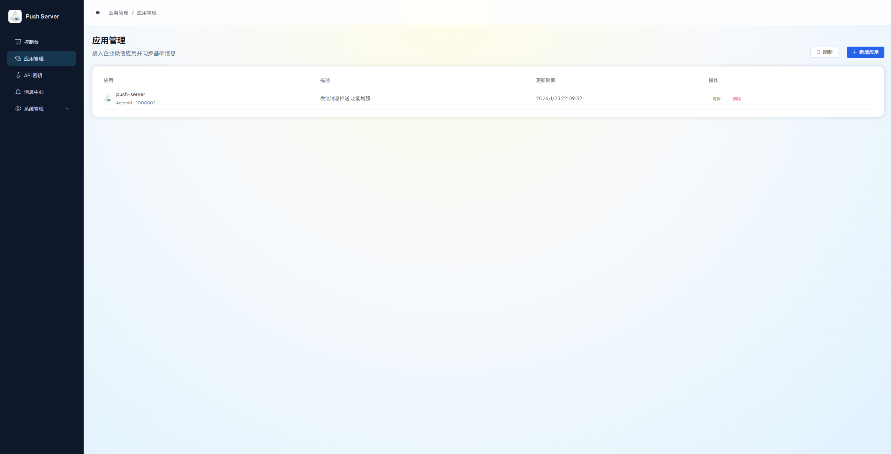
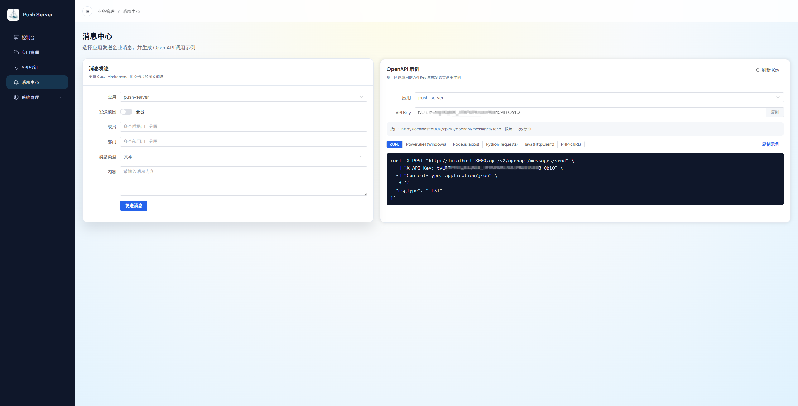
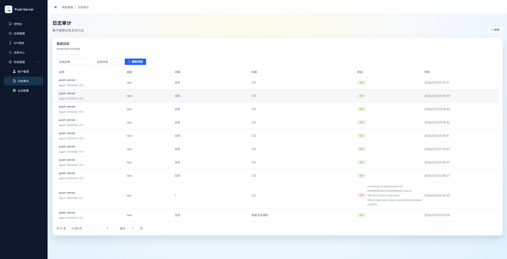
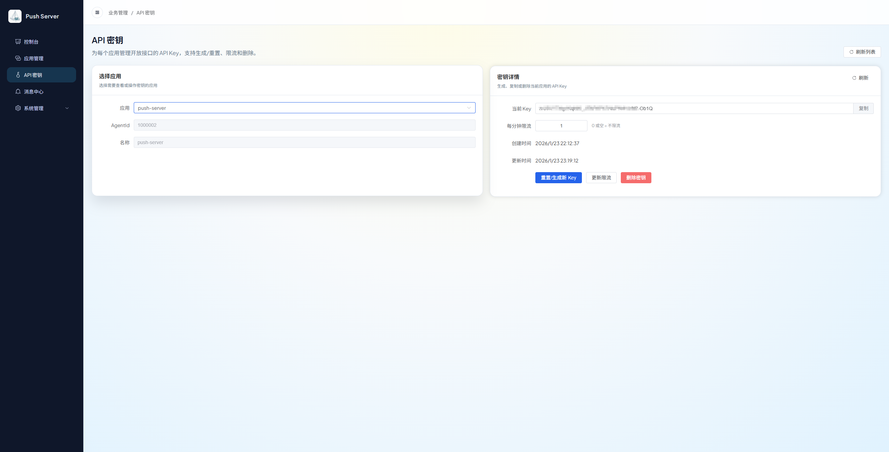
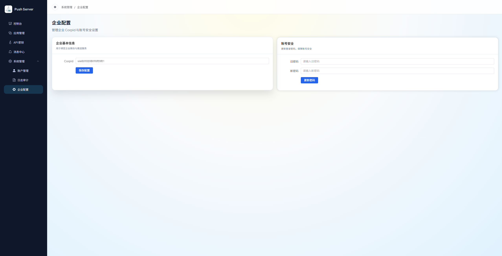

# push-server


**push-server** 是一个基于 Spring Boot 4 构建的、带管理后台的轻量级企业微信推送服务。它封装了企业微信复杂的 API，对外提供极其简单的 HTTP 接口，支持 Docker 原生镜像部署（启动仅需 0.1s，内存占用 <50MB）。

---

## 📖 项目定位与目标

**push-server** 的核心目标是：

> **通过企业微信（WeCom），将系统消息稳定、合规地推送到用户的微信中接收。**

整体消息流转路径如下：



---

## ⚡️ 核心特性

* **轻量级 & 高性能**：基于 Spring Boot 4 + GraalVM Native Image，极致的启动速度和资源占用。
* **Web 管理后台**：内置 Web UI，支持在线完成所有配置（企业微信、应用、API Key），查看推送日志和统计报表。
* **多应用隔离**：支持管理多个企业微信应用，每个应用拥有独立 API Key 和限流策略。
* **内嵌数据库**：默认使用 SQLite 数据库，无需安装额外的数据库服务。
* **开箱即用**：无需复杂配置，首次运行后通过 Web 页面即可完成初始化。

---

## 🛠️ 技术栈

* **后端**: Spring Boot 4, Java 25, MyBatis Plus
* **前端**: Vue 3, Element Plus
* **数据库**: SQLite (内嵌)
* **运行时**: GraalVM (支持 Native Image 编译)

---

## 📸 界面预览

<p align="center">
  
  <br>
  <em>仪表盘统计</em>
</p>

| 系统初始化 | 系统登录 |
| :---: | :---: |
|  |  |

| 应用管理 | 在线调试 |
| :---: | :---: |
|  |  |

| 推送日志 | 密钥管理 |
| :---: | :---: |
|  |  |

| 系统设置 | 用户管理 |
| :---: | :---: |
|  |  |

---

## 🚀 快速开始 (Docker)

推荐使用 Docker 运行，无需安装 Java 环境。

```bash
docker run -d \
  --name push-server \
  -p 8000:8000 \
  -v $(pwd)/data:/app/data \
  qingzhoudev/push-server:latest
```
* **数据持久化**: `-v $(pwd)/data:/app/data` 会将应用数据（包括 SQLite 数据库）保存到当前目录下的 `data` 文件夹中。
* **首次运行**: 启动后，访问 `http://localhost:8000`，系统会自动跳转至**初始化页面**。请根据引导完成管理员账号注册和企业微信配置。

### Docker Compose

如果您更习惯使用 Docker Compose，可以使用以下配置：

```yaml
services:
  push-server:
    image: qingzhoudev/push-server:latest
    container_name: push-server
    ports:
      - "8000:8000"
    volumes:
      - ./data:/app/data
    restart: unless-stopped
```

启动命令：
```bash
docker-compose up -d
```

---

## 🛡️ 安全配置

为了提高系统安全性，建议在**系统设置**中开启 **Cloudflare Turnstile** 验证。

* **风险**: 未开启验证可能导致登录接口面临暴力破解或恶意攻击风险。
* **配置**: 开启验证需前往 [Cloudflare](https://www.cloudflare.com/products/turnstile/) 获取 Site Key 和 Secret Key，并在系统设置中填入。

---

## 🔌 API 文档

**push-server** 提供 V2 和 V1 两套 API。**强烈推荐使用 V2 API**。

### V2 API (推荐)

V2 API 提供了更强大、更标准的功能。

* **鉴权**: 使用在 **Portal 管理后台** -> **应用管理** 中为每个应用生成的 **API Key**。在请求时，将其放入 `X-API-Key` Header 中。
* **详细文档**: 完整的 API 定义和示例请参考 [**V2 OpenAPI 文档**](./docs/openapi-v2.md)。

**调用示例 (发送文本消息):**
```bash
curl -X POST http://localhost:8000/api/v2/openapi/messages/send \
  -H "X-API-Key: 您在后台生成的App API Key" \
  -H "Content-Type: application/json" \
  -d '{
    "toUser": "ZhangSan|LiSi",
    "msgType": "text",
    "content": "系统通知：您的任务已构建完成。"
  }'
```

### V1 API (兼容)

V1 API 为保持向后兼容而保留。

* **鉴权**: 使用在 `application.yml` (或环境变量 `PUSH_AUTH_KEY`) 中配置的**全局 Token**。
* **URL**: `/api/v1/push`
* **Method**: `POST`
* **Header**: `X-API-Key: <push.auth.key>`

**调用示例 (发送文本消息):**
```bash
curl -X POST http://localhost:8000/api/v1/push \
  -H "X-API-Key: 全局Token" \
  -H "Content-Type: application/json" \
  -d '{
    "target": "ZhangSan|LiSi",
    "type": "TEXT",
    "content": "系统通知：您的任务已构建完成。"
  }'
```

---

## ⚙️ V1 配置说明 (不推荐)

以下配置仅适用于旧版 V1 API。V2 的所有配置均在 Portal 后台在线完成。

```yaml
# application-prod.yml
push:
  auth:
    key: "v1-global-token" # V1 使用的全局 Token
  wecom:
    app-key: "你的企业ID"      # V1 使用
    app-secret: "你的应用Secret" # V1 使用
    agent-id: "你的应用AgentID"   # V1 使用
```
---
## 🤝 鸣谢 (Credits)

本项目是**AI 辅助开发**的实践案例，特别鸣谢：

* **[Google Gemini](https://gemini.google.com/)**：深度参与了本项目的开发全过程，独立完成了**全部前端代码的编写、UI/UX 设计以及样式优化**，展现了卓越的代码生成与设计能力。
* **开源社区**：感谢 Spring Boot, Vue, Element Plus 等优秀开源项目提供的坚实基础。

如果你喜欢这个项目，请不要吝啬你的 Star！🌟